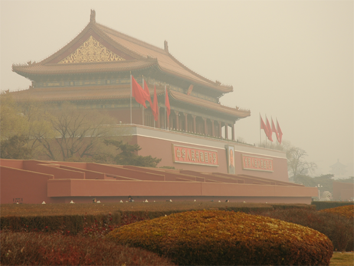
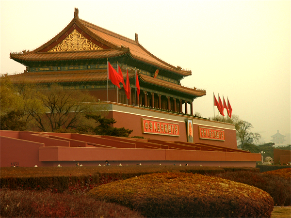
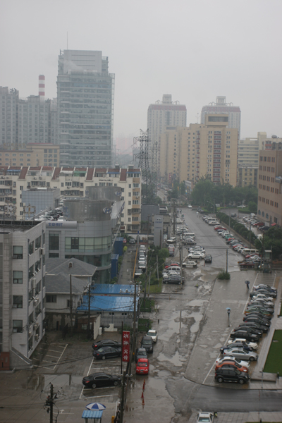
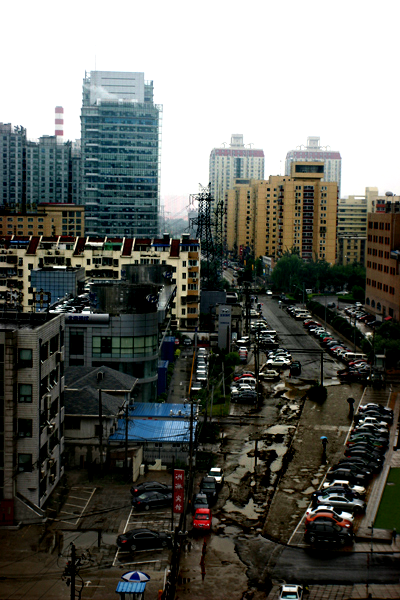
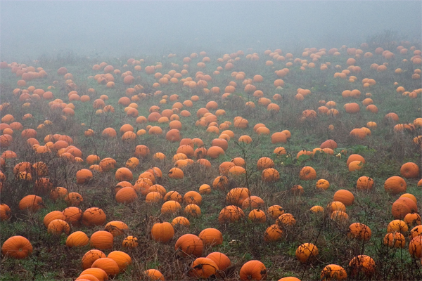
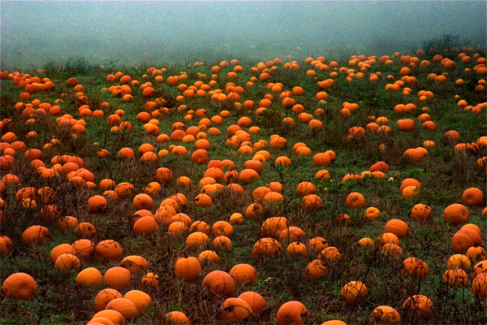

# Non-Local Dehazing Python Implyment
## Introduction
This code is the repreduction of the paper 
[Berman_Non-Local_Image_Dehazing -_CVPR_2016](https://openaccess.thecvf.com/content_cvpr_2016/papers/Berman_Non-Local_Image_Dehazing_CVPR_2016_paper.pdf)
## Compile Dependencies
* Python
* Numpy
* OpenCV
* scipy.sparse
* kdtree [Click Here](https://github.com/stefankoegl/kdtree)

## Examples
* Tiananmen  

* City  

* Pumpkin  

